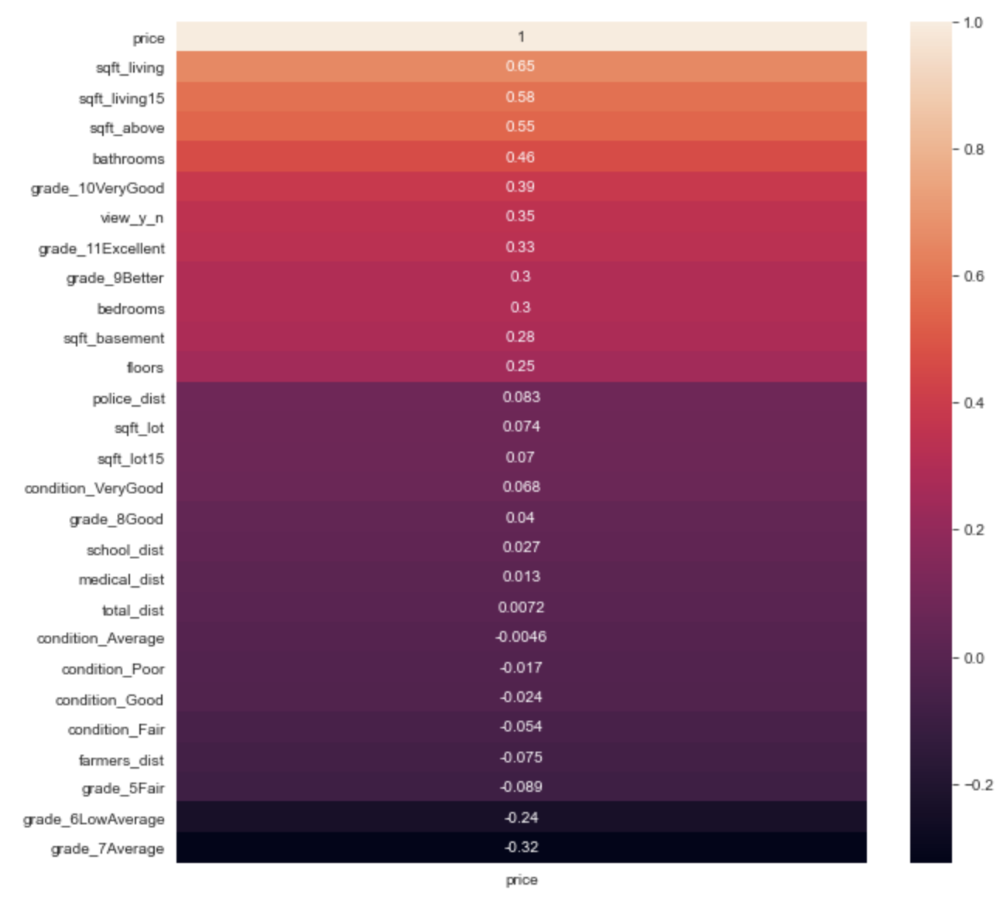

# King County Housing Price Analysis by Copper Consulting
- Alex Dohn
- Alex Marshall
- Scott Schumann

## Overview

We have been tasked with analyzing housing market data for King County, WA to determine which features correlate most strongly with sale price. Our group is working for a local real estate company to provide them with more detailed information to give to their clients so that they can more accurately determine what price they should ask for their home. Given that there is a wide variety of house types in the market, we have been tasked specifically with analyzing information pertaining to single family homes in the area.

## Business Problem

Our task is analyzing housing data features that correlate most strongly with sale price. This is valuable information for our stakeholder given that they will be able to provide more accurate information to their clients regarding the potential sale price of their home. Before looking at the data, we decided to do some research into the features that tend to correlate with sale price in the US market in general, just to get some ideas of what might be important for our data set in King County, WA:

According to Joe Gomez (https://www.opendoor.com/w/blog/factors-that-influence-home-value), some of the factors that influence a home's value are:
1) Prices of other homes in the neighborhood that have sold recently\
2) Places of interest close to the neighborhood\
3) Home size

Rocket Mortgage also includes a list of factors that they use when putting together a comparitive market analysis (https://www.rocketmortgage.com/learn/comparative-market-analysis):
1) Location\
2) Lot size/square footage\
3) Age and condition of property\
4) Number of bedrooms and bathrooms

Along with our task of looking at single family homes, we used these features as a starting point when we began to examine the data.

## Data Understanding

Here is the data we will be using for this project:

- Our primary data set is 'King County House Sales,' which contains a lot of information related to house sales in King County, WA between the years 2014–2015.
- We also used Geographic Information System (GIS) data from 'King County GIS Open Data' (https://gis-kingcounty.opendata.arcgis.com/). This data was included in our model in order to determine the distance from each house in the data set to certain places of interest in King County, WA (e.g. schools, police stations, medical facilities, farmers markets, etc.).
- The 'King County House Sales' data set contains data related to 21597 houses sold in King County, WA between 2014 & 2015. For each house (id), the data set includes information including: 
    - The date and price at which the house was sold
    - Information about the house itself: 
        - Sqaure footage of the house and the lot. 
        - No. of bedrooms, bathrooms, and floors.
        - Whether or not it is located on a waterfront or has some otherwise quality view.
        - The condition and grade of the house.
        - The year in which it was built and (if applicable) the year in which it was renovated.
        - Location data including lat and long coordinates, and zip code.
    - Sqaure footage of the house and the lot for the neighboring 15 homes.
- Given that we are building our model to predict sale price, we will use the 'price' column as our target variable.
- In the models contained in this notebook, these are the primary variables we will focus on, along with a brief description of their properties:
    - 'sqft_living': Square footage of living space in the home (continuous variable).
    - 'view': Quality of view from house (this is a categorical variable that we will later bin into a binary 'yes/no' column.
    - 'total_dist': This is a relative measure of distance between each home (location determined using 'lat' and 'long' data) from four places of interest—police stations, schools, medical facilities, and farmers markets (continuous variable).
    - 'sqft_living15': The square footage of interior housing living space for the nearest 15 neighbors (continuous variable)
    - 'bedrooms': Number of bedrooms (categorical variable).
    - 'pos_condition': Based on data from the 'condition' column, which is defined as a measure of "How good the overall condition of the house is. Related to maintenance of house." We will later bin the top two 'condition' ratings to create this binary column (categorical variable).
    - 'pos_grade': Based on data from the 'grade' column, which is defined as a measure of "Overall grade of the house. Related to the construction and design of the house." We will later bin the top three 'grade' ratings to create this binary column (categorical variable).

## Data Preparation

- Bedrooms: We filtered for houses with 5 or fewer bedrooms given that our business understanding is tailored to single family homes.
- Bathrooms: Along similar lines, we filtered for houses with 4 or fewer bathrooms. We also filtered out houses with less than 1 full bathroom given that there were a couple of outliers.
- Waterfront: Given the large number of values for "NO" in this column, we decided that dropping it would not significantly impact our analysis.
- View: We binned this into a binary Y/N column to create a more even distribution of values.
- Grade: We removed Luxury and Mansion grades keeping in mind our business understanding of single family homes. We also removed Low as only 14 houses meet criteria. 
- Year Renovated: Filled in null values.
- Square Footage of the Basement: We replaced the '?' values in some of the rows with "0", and then converted all values in this column to numeric (they were initially defined as "objects").
- Additional data preparation is done throughout the notebook as we built more models in order to improve performance. Notes pertaining to these additional preparations are included in the relevant sections below.
- Geodata was added to the notebook by processing shapefiles downloaded from [King County GIS Open Data](https://gis-kingcounty.opendata.arcgis.com/) Each file consisted of point data for sites of interest in King County: medical centers, schools, police stations, and farmers markets; each type of site was selected for its appeal to prospective homebuyers. Using a custom function the nearest station, market, etc. for each house in the primary dataframe was discovered as well as its distance, in degrees, to the house. The file containing the function can be found [here](https://github.com/Shoemaker703/home_sales_analysis_project/blob/main/notebooks/Alex%20M/distance_function.py) and the workbook the processing was done in can be found [here](https://github.com/Shoemaker703/home_sales_analysis_project/blob/main/notebooks/Alex%20M/GIS_data.ipynb)

- Inclduing this "missingno matrix" to demonstrate that there are no null values in our cleaned data set.

## Modeling (Simple Linear Regression)

- First we looked at the correlations between price and other features in the data set, and found that 'sqft_living' has the strongest correlation. Thus, we decided to use this feature for our simple model.
- The square footage of the living space in the house is an important feature for single family homes, as discussed above in the 'business understanding' section of this notebook (see references to Joe Gomez and Rocket Mortgage).

## Modeling (Multiple Linear Regression)

- After evaluating our simple model's performance, we decided to start adding features in addition to 'sqft_living' to see if we could improve our model's performance. 

# Final Model
- Here are the evaluations for the final model, as well as a barplot including the coefficients for each predictor.

## Conclusions
Our final model explains roughly 52% of the variance in sale price for homes in King County, WA.
- The square footage of the living area in each house accounts for a 22.8% increase in sale price.
- The sqaure footage of the living area in each of the neighboring 15 houses accounts for an 8.8% increase in sale price.
    - We think it makes sense that there is a connection between the square footage of houses in the same neighborhood. As both of these features increase in size, the sale price increases. In other words, large houses surrounded by other large houses will probably be more appealing to buyers rather than large houses in neighborhoods full of smaller houses.
- We also found that a house with a high grade ("Better, Very Good, or Excellent") accounts for a 9.3% increase in sale price. Similarly, we found that houses with an above average condition account for a 3.7% increase in sale price. 
    - Our model saw a slightly better performance when we only used houses with a "Very Good" condition, but we felt that using "Above Average" (includes "Very Good" and "Good" conditions) would be somewhat easier to explain to our non-technical stakeholders.
- If the house has a good view, our model accounts for a 6.3% increase in sale price.
    - This is interesting in that our model suggests that there is a 6.3% decrease in sale price for houses that are closer to places of interest in the neighborhood (e.g. police stations, hospitals, farmers markets, schools, etc.). The negative correlation is to be expected given that the closer you are to some of these places of interest, the lower the total distance value is in our calculations, which corresponds to an increase in sale price.
- We were initially surprised to see a 3.5% decrease in sale price correlated with an increase in number of bedrooms, but our thought is that once a house has more than three bedrooms (the mean for this data set is 3.3, which we can round down to 3) it might become less appealing to buyers.

## Limitations
- Given that we focused on what we considered "single family homes," there are some more expensive/fancy houses that our model will not be able to predict very effectively. 
- Our distance metric weighted all four points of interest equally. In future iterations, we will explore giving different values to different places of interest based on type to see how this impacts model performance.

## Future Directions
There are a number of possible directions to go in the future, but here are some thoughts we have regarding possible ways to expand this initial study:
- Look into more detailed location information to see the impacts of different places of interest on sale price.
- Look into more specific impacts of individual conditions and grades (rather than the binned versions of those features we used in our final model).
- More feature engineering with bedrooms and bathrooms (what combination of these features is most strongly correlated with sale price).
- Organizing data by zipcode to see what impact this has on our model.
- Analyzing year built/renovated.
- Examine properties with multiple sale records to see what trends led to changes in sale price.

# Repository Structure

├── home_sales_analysis_project    <- top level contains project notebook, README, presentation slide deck, and .gitignore\
│   ├── data                       <- contains CSV files used for project.\
│   ├── images                     <- contains PNG files used in this README\
│   └── notebooks                  <- contains Jupyter notebooks created by each team member\
│       ├── Alex D           
│       ├── Alex M\
│       |   └── GIS Data           <- contains shape files for additional geo data used for project\
│       └── Scott S

# For More Information
See the full analysis in the [Jupyter Notebook](https://github.com/Shoemaker703/home_sales_analysis_project/blob/main/Project2_final.ipynb) or review this [presentation](https://github.com/Shoemaker703/home_sales_analysis_project/blob/main/KC%20HOUSING%20PROJECT.pdf).

For additional info, contact Alex Dohn at alexdohn2016@gmail.com, Alex Marshall at alex.marshall842@outlook.com, or Scott Schumann at Scott.Schumann1@gmail.com
